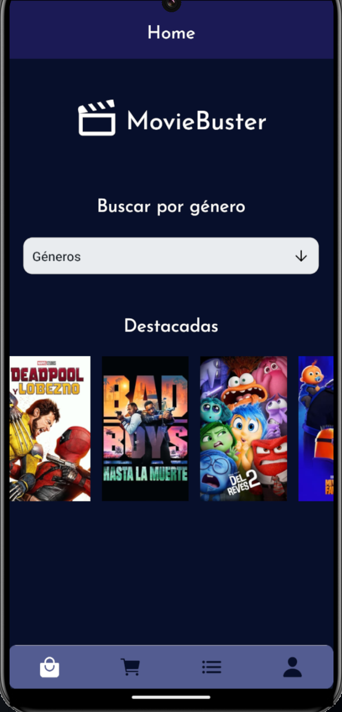
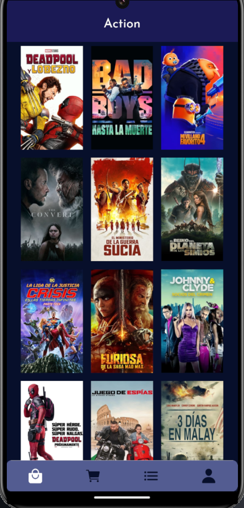
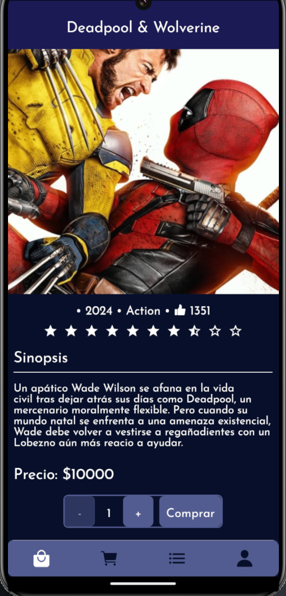
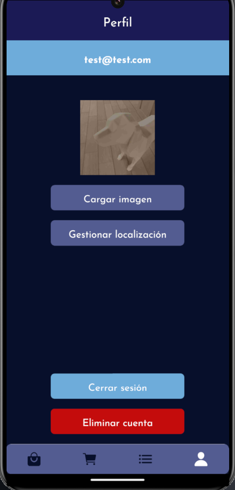

# MovieBuster - React Native

Una aplicación de comercio electrónico de venta de películas desarrollada con React Native que ofrece una experiencia de compra completa y fácil de usar.

## Funcionalidades Principales

### Pantalla de login y registro

- Ambas muestran un formulario para poder registrarse y loguearse según el caso. Al registrarse, si el registro fue exitoso, redirecciona a la pantalla de login para poder ingresar.

### Pantalla de Home

- La pantalla principal muestra un buscador de géneros y un listado horizontal de péliculas destacadas

### Pantalla de Lista de películas

- Muestra un listado de las películas filtradas por el género seleccionado en la Home, mostrando el póster de cada una
- Al hacer clic en una película, se navega a la pantalla de detalle de la misma

### Pantalla de Detalle de película

- Proporciona una descripción detallada de la película
- Muestra el precio
- Permite seleccionar la cantidad de unidades a comprar y agregar la película al carrito

### Pantalla de Perfil

- **Acceso seguro:** Sólo los usuarios autenticados pueden acceder a la pantalla de perfil y realizar compras
- **Información del usuario:** Muestra el email del usuario logueado
- **Cambiar imagen de perfil**: Es posible modificar la imagen de perfil del usuario utilizando la cámara del dispositivo. Si no existe una imagen guardada se muestra una ícono por default.
- **Gestionar localización**: Muestra un listado de direcciones del usuario, y es posible agregar una nueva dirección. Cada dirección del listado tiene dos acciones: seleccionarla como preferida (donde se enviará el pedido) y eliminarla
- **Acciones del usuario**:
  - Cerrar sesión: cierra la sesión del usuario
  - Eliminar cuenta: remueve la cuenta de la base de datos

### Autenticación con Firebase

- Utiliza el sistema de autenticación de Firebase para gestionar el acceso de usuarios
- Permite a los usuarios iniciar sesión y registrarse de manera segura

## Navegación Inferior

- **Pestaña 1 - Shop:** Géneros y películas (stack principal)
- **Pestaña 2 - Carrito:** Detalles del carrito de compras con resumen y botón para finalizar la orden
- **Pestaña 3 - Órdenes:** Historial de órdenes realizadas por el usuario
- **Pestaña 4 - Perfil:** Información del usuario, carga de imagen de perfil, lista de ubicaciones guardadas, y acciones de cerrar sesión y eliminar cuenta

## Tecnologías Utilizadas

- **React Native Navigation Stack:** Gestiona la navegación entre pantallas.
- **React Native Navigation Bottom Tabs:** Gestiona la navegación entre pestañas.
- **Expo-Location:** Permite acceder y gestionar la ubicación del usuario.
- **Expo-Picker-Image:** Facilita la carga de imágenes de perfil.
- **Redux:** Centraliza y gestiona el estado de la aplicación.
- **RTK Query y Firebase:** Realiza operaciones de lectura/escritura en la base de datos.
- **Firebase Authentication:** Implementa el sistema de autenticación de Firebase para gestionar la seguridad de la aplicación.

## Instalación

1. Clona el repositorio: `git clone https://github.com/Sebaavt95/rn-ecommerce-project`
2. Instala las dependencias: `npm install`
3. Configura las claves de API para servicios externos (Expo-Location, Firebase, etc.).
4. Configura las credenciales de Firebase en tu proyecto.
5. Ejecuta la aplicación: `npm start`

## Contacto

Para preguntas o soporte, contacta a <sebaavitiello@gmail.com>
